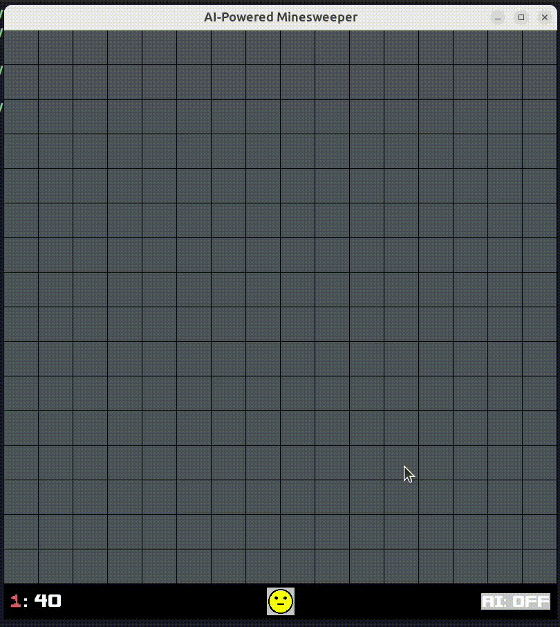

# AI-Powered Minesweeper
A twist on the classic Minesweeper, written in C++ using [SFML](https://www.sfml-dev.org/). Combines (in my opinion) the best features of the Google version and other minesweeper sites, perfect for the way I like to play it.



---
## Features
- **AI assistant**: A toggleable algorithm that performs all deterministic/logically certain moves, with a visualizer. "RNG" moves are left up to you.
    - Alternatively, pressing/holding spacebar steps the algorithm.
- **Chord support**: Clicking a revealed, numbered tile will reveal all adjacent, non-flagged tiles. This is allowed, provided that the number of adjacent flagged tiles matches the number of adjacent mines.
- **First-move safety**: Unlike most minesweeper implementations, the first move is guaranteed to be safe and reveal a 3x3 area. This prevents automatic, "unfair" losses.
---
## Build and running
Guaranteed to be compatible on any Linux system with SFML support. 

Windows/macOS untested.
```bash
git clone git@github.com:clayton-chung/AI-Powered-Minesweeper.git
cd minesweeper
mkdir build && cd build
cmake ..
make
./Minesweeper
```
