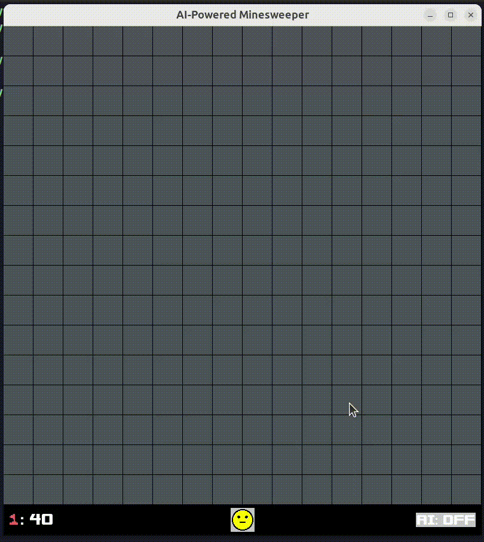

# AI-Powered Minesweeper

[](https://github.com/clayton-chung/AI-Powered-Minesweeper/actions/workflows/ci.yml)

A C++ Minesweeper built on [SFML](https://www.sfml-dev.org/), with a built-in solver that handles every deterministic move so the player only has to make actual guesses.



## Features
- **AI solver** — toggleable algorithm that flags or reveals every tile whose state is logically forced by its neighbors. Tap `Space` to step through one move at a time, or click the `AI` button to let it run continuously. The tile currently being analyzed is highlighted in yellow.
- **Chord clicks** — left-clicking a revealed numbered tile reveals all of its non-flagged neighbors, but only if the flagged count matches the number. A standard speed-play feature.
- **First-click safety** — the first reveal is always safe across a 3×3 area. Mines inside that zone are relocated to a random tile outside it, and adjacency counts are recomputed.

## Controls

| Input | Action |
| --- | --- |
| Left click | Reveal tile (chord if already revealed and numbered) |
| Right click | Toggle flag |
| `Space` | Step the AI solver one move |
| AI button | Toggle continuous AI solving (200 ms/step) |
| Restart button | Reset the board |

## Build & Run

Requires SFML 2.5+ and a C++17 compiler. Tested on Linux; Windows/macOS untested.

```bash
git clone git@github.com:clayton-chung/AI-Powered-Minesweeper.git
cd AI-Powered-Minesweeper
mkdir build && cd build
cmake ..
make
./Minesweeper                        # medium (default)
./Minesweeper easy | medium | hard
./Minesweeper <rows> <cols> <mines>  # custom board
```

Presets: Easy (9×9, 10 mines), Medium (16×16, 40), Hard (16×30, 99). Custom boards require `rows ≥ 3`, `cols ≥ 3`, and `mines ≤ rows*cols - 9` (the 3×3 safe area must always fit).

## How the AI works

`Board::AISolver()` scans every revealed numbered tile and applies two constraint rules. It returns after the first action it takes, so each call — whether triggered by `Space` or the continuous-mode timer — represents a single deterministic step.

For a revealed tile with adjacency count `n`, `f` flagged neighbors, and `u` unrevealed non-flagged neighbors:

1. **If `f == n` and `u > 0`** — every mine around this tile is already flagged, so every remaining unrevealed neighbor is safe. Reveal them all.
2. **If `u == n - f`** — every remaining unknown must be a mine. Flag them all.

When neither rule fires anywhere on the board, the player has to guess. The solver does not (yet) handle subset deduction (e.g. 1-2-1 walls) or probabilistic guessing.

## Implementation notes

- **`Board`** owns the grid as a flat `std::vector<Tile>` indexed by `y * cols + x`, plus all game logic (reveal, flag, chord, solver). The 3×3 neighbor iteration is centralized in a single `forEachNeighbor` template helper, used by `reveal`, `chord`, the solver, and the adjacency recomputation.
- **`Game`** owns the SFML window, the main loop (`processEvents` / `update` / `render`), and the UI. Continuous-mode AI is gated by an `sf::Clock` rather than a separate thread, which keeps the rendering deterministic and easy to reason about.
- **First-click safety via relocation rather than lazy placement.** Mines are placed at `reset()` time. If the first click lands on or next to one, those mines are moved to random tiles outside the 3×3 safe zone and adjacency is recomputed. This keeps `reveal()`'s contract simple — it always runs against a fully-formed board.

## Possible improvements

- Constraint-propagation solver pass for subset patterns (1-2-1, 1-1 corners, etc.).
- Probabilistic guessing when the solver is stuck (pick the lowest-risk tile).
- In-game difficulty menu instead of CLI-only configuration.
